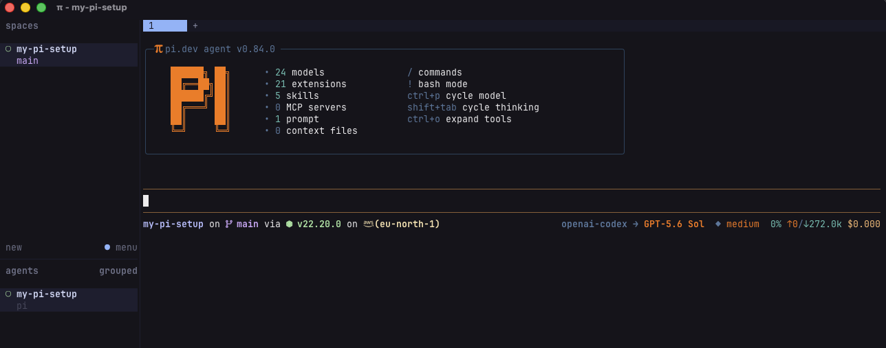

# My Pi Setup

A modular, shareable [Pi](https://github.com/earendil-works/pi-mono) coding environment. Each customization stays separate so it can be installed, removed, or adapted independently. Please do not hard-copy the setup unchanged—use it as a starting point and customize it for your own workflow.



## Directories

- `assets/` — screenshots and supporting files
- `extensions/` — Pi extensions and extension referrals
- `skills/` — reusable agent skills
- `themes/` — custom Pi TUI themes

## Custom Extensions

- [`ask-user`](extensions/ask-user/README.md) — Adds the `ask_user` tool for one focused question with choices, freeform answers, timeouts, and Herdr blocked-state integration.
- [`goal`](extensions/goal/README.md) — Runs a persistent, verification-aware objective loop with automatic continuation and bounded turn batches.
- [`permission-gate`](extensions/permission-gate/README.md) — Requests approval for risky shell commands with global, project, and session policies, exact-command approvals, and session YOLO mode.
- [`pi-clip`](extensions/pi-clip/README.md) — Adds `/clip` for selecting and copying code blocks, tables, lists, ranges, prompts, or responses.
- [`pi-startup`](extensions/pi-startup/README.md) — Replaces the standard startup header with a responsive dashboard showing the Pi logo, resource counts, shortcuts, and version.
- [`plan-mode`](extensions/plan-mode/README.md) — Provides a PLAN → EXECUTE workflow with read-only planning tools and controlled transition into implementation.
- [`review`](extensions/review/README.md) — Adds a temporary read-only `/review` workflow for working trees, branches, commits, paths, and GitHub pull requests.
- [`session-insights`](extensions/session-insights/README.md) — Adds a theme-aware `/usage` dashboard for session, token, cost, model, project, and tool statistics.
- [`simply-file-search`](extensions/simply-file-search/README.md) — Registers fast `simply_find` and `simply_grep` tools backed by `fd`, `rg`, and optional fuzzy ranking through `fzf`.
- [`starship-statusline`](extensions/starship-statusline/README.md) — Adds a configurable Starship-powered footer with model and Git information.
- [`theme-picker`](extensions/theme-picker/README.md) — Adds `/theme` with fuzzy search, live preview, rollback on cancellation, and global theme persistence.
- [`whimsical`](extensions/whimsical/README.md) — Replaces the working message with hundreds of playful first-turn and follow-up phrases, toggled with `/whimsy`.

### Third-party extension referrals

These directories document upstream packages without vendoring or loading them:

- [`pi-fff`](extensions/pi-fff/README.md) — Indexed fuzzy file and content search from `npm:@ff-labs/pi-fff`.
- [`pi-goal-list-loop-audit`](extensions/pi-goal-list-loop-audit/README.md) — Advanced task queues, process loops, and isolated completion audits.

## Themes

- [`aura`](themes/aura.json) — Deep charcoal with violet accents and mint highlights.
- [`catppuccin-mocha`](themes/catppuccin-mocha.json) — Soft Mocha surfaces with teal and blue accents.
- [`dracula-plus`](themes/dracula-plus.json) — Dark neutral panels with vivid Dracula-inspired green, red, and gold.
- [`gruvbox-dark-hard`](themes/gruvbox-dark-hard.json) — High-contrast Gruvbox dark palette with warm yellow accents.
- [`gruvbox`](themes/gruvbox.json) — Classic warm retro Gruvbox colors on a dark background.
- [`nebula-pulse`](themes/nebula-pulse.json) — Near-black cosmic palette with electric violet and cyan.
- [`nightowl`](themes/nightowl.json) — Deep navy Night Owl palette with cyan and blue highlights.
- [`opencode`](themes/opencode.json) — Minimal near-black interface with warm peach and purple accents.
- [`rose-pine`](themes/rose-pine.json) — Muted rose, lavender, gold, and pine tones.
- [`synthwave-84`](themes/synthwave-84.json) — Neon pink and cyan Synthwave colors over deep purple surfaces.
- [`tokyo-night`](themes/tokyo-night.json) — Cool blue and violet Tokyo Night palette with balanced syntax colors.

Use `/theme` when the theme picker extension is active, or select a theme through Pi's settings.

## Install and Update

Install the complete package globally from GitHub:

```bash
pi install https://github.com/sina96/my-pi-setup.git
```

Pull future extension and theme changes with:

```bash
pi update --extensions
```

Then run `/reload` or restart Pi.

## Notes

`extensions/herdr-agent-state.ts` is generated and managed by Herdr. Put custom extensions beside it rather than editing it.
